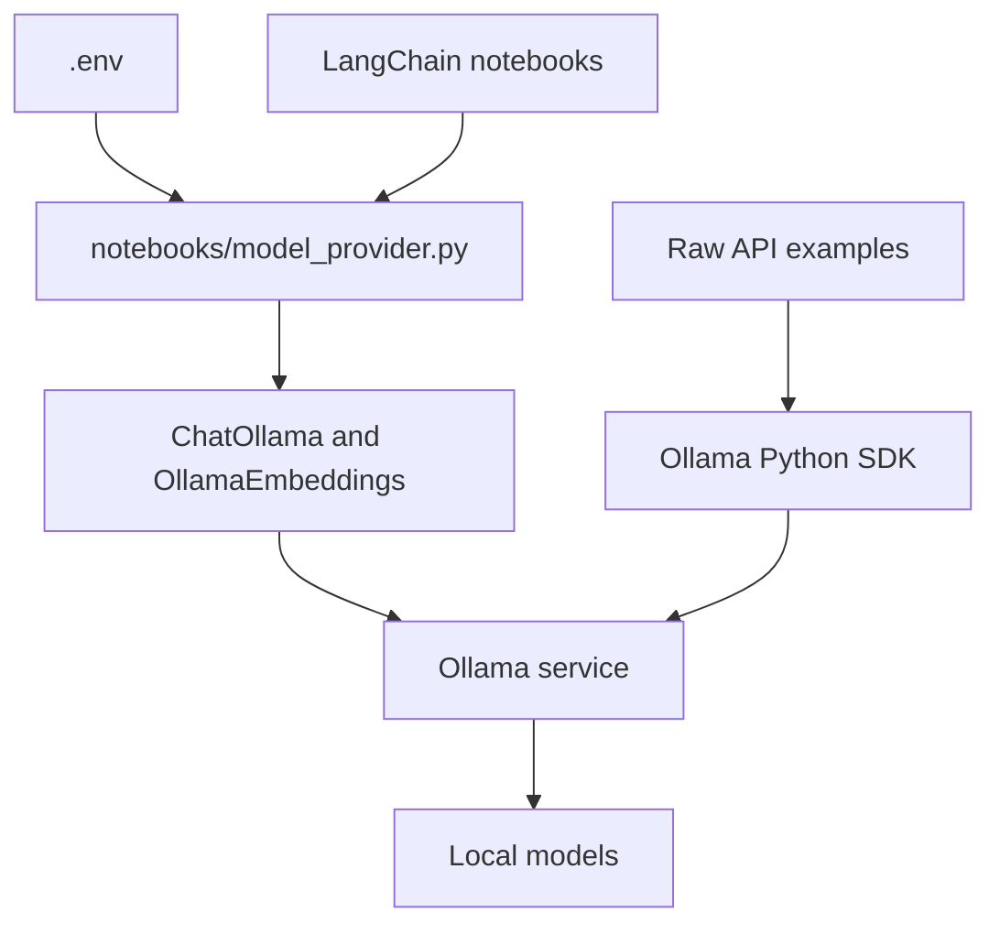

# Requirements

### Overview & Goals
Replace OpenAI as the model provider across the repository’s provider-dependent notebooks with local Ollama, while preserving each chapter’s demonstrated chain, retrieval, agent, memory, tracing, and output-parsing behavior.

### Scope
- Migrate `notebooks/02`–`05`, `08`–`09`, `11`–`15`, `17`–`20`, and `22`–`23` where they use OpenAI chat or embedding integrations.
- Update shared setup in `README.md`, `.env.example`, `pyproject.toml`, and `uv.lock`.
- Keep unrelated integrations and credentials, including Tavily and optional LangSmith, unchanged.
- Exclude notebooks that do not use OpenAI-backed models; no changes to the chapter content beyond provider setup and outputs that become stale.

### Functional Requirements
- Use a shared Ollama chat/embedding configuration and preserve `MODEL` and `EMBEDDING_MODEL` as configurable Ollama model identifiers; document Ollama service setup, model pulls, and an optional `OLLAMA_BASE_URL`.
- Remove the requirement for `OPENAI_API_KEY` and replace OpenAI-specific installation instructions and dependencies.
- Preserve structured outputs, LCEL chains, vector retrieval, LangGraph tool calls, semantic memory, and LangSmith tracing where applicable.
- Replace direct OpenAI SDK demonstrations with equivalent native Ollama SDK calls rather than routing them through an OpenAI-compatible endpoint.
- Refresh or clear saved OpenAI-specific errors and outputs so notebooks do not show stale provider results.

# Technical Design

### Current Implementation
- This is a notebook-first repository with no application source package. `notebooks/prompts.py` is a shared module imported directly by Chapters 17–20, providing a precedent for a notebook-local model helper.
- `README.md` and `.env.example` describe OpenAI setup and the shared `MODEL`/`EMBEDDING_MODEL` convention; `pyproject.toml` declares `openai`, with dependency resolution captured in `uv.lock`.
- The affected notebooks currently use `ChatOpenAI`, `OpenAIEmbeddings`, provider-prefixed `init_chat_model("openai:...")`, and raw `openai.OpenAI` clients (notably the Chapter 2 baseline and Chapter 11 agent).
- OpenAI embeddings also back Chapters 8–9 and LangGraph semantic memory in Chapter 18; Chapter 2, Chapter 3 routing, and Chapters 17–18 use structured output, while Chapter 11 uses `.bind_tools`.

### Key Decisions
- Add `notebooks/model_provider.py` with shared `get_chat_model(temperature=...)` and `get_embeddings()` factories built on `langchain-ollama`; read model identifiers and optional service URL from the shared environment configuration.
- Use native Ollama SDK calls only for the direct-API teaching examples; use the shared factories for LangChain chat/embedding flows.
- Pass the shared Ollama embeddings object to LangGraph’s memory-store index instead of the current `openai:` provider string, and keep the embedding dimensions aligned with the configured model.
- Preserve unrelated LangGraph, LangMem, LangSmith, and external search behaviors; choose/document an Ollama chat model that supports the structured-output and tool-calling examples.

### Proposed Changes
- Replace OpenAI imports and model construction with the shared factories across the in-scope notebooks.
- Convert the raw Chapter 2 completion example and Chapter 11 custom agent to the native Ollama client while retaining their pedagogical purpose.
- Update per-notebook setup prose, root installation/configuration documentation, direct dependencies, and lockfile; remove OpenAI API-key setup.
- Remove or regenerate stale OpenAI execution outputs and errors in affected notebooks.

### File Structure
- Add `notebooks/model_provider.py`.
- Update `README.md`, `.env.example`, `pyproject.toml`, and `uv.lock`.
- Update provider-dependent notebooks: `02-model-io-prompts-and-parsing.ipynb`, `03-chains.ipynb`, `04-memory.ipynb`, `05-evaluation.ipynb`, `08-vector-stores-and-retrieval.ipynb`, `09-question-answering-over-documents.ipynb`, `11-building-agents.ipynb`, `12-agentic-web-search.ipynb`, `13-persistence-and-streaming.ipynb`, `14-human-in-the-loop.ipynb`, `15-multi-agent-essay-writer.ipynb`, `17-baseline-email-agent.ipynb`, `18-semantic-memory.ipynb`, `19-episodic-memory.ipynb`, `20-procedural-memory.ipynb`, `22-tracing-with-langsmith.ipynb`, and `23-playground-and-prompts-hub.ipynb`.

### Architecture Diagram

### Risks
- Tool calling and structured-output reliability depends on the selected Ollama model; document model requirements and keep model identifiers overrideable.
- Ollama embedding dimensions must match the configured LangGraph/vector-store index and any persisted local vector data; rebuild notebook-created stores when switching embedding models.

# Testing

### Validation Approach
- Validate notebook structure and ensure affected notebooks import the shared provider module and no longer require OpenAI-specific packages or credentials.
- Synchronize dependency metadata and confirm the lockfile resolves the Ollama packages.
- With Ollama running and the documented models pulled, smoke-test chat, embeddings, structured output, tool calls, and semantic retrieval.

### Key Scenarios
- Run Chapters 2–5 and 8–9 to cover native SDK use, LCEL, structured routing, embeddings, and RAG.
- Run representative agent and memory flows from Chapters 11–20, including tool invocation and `InMemoryStore` semantic search.
- Check Chapters 22–23 retain their LangSmith tracing and prompt-hub flows using the Ollama-backed chat model.
- Confirm no stale OpenAI error/output snapshots or API-key instructions remain in the migrated notebooks and setup files.

# Delivery Steps

### ✓ Step 1: Add shared Ollama provider setup
A shared Ollama model provider and repository setup are available to all affected notebooks.
- Add `notebooks/model_provider.py` with chat and embedding factories using `ChatOllama` and `OllamaEmbeddings`.
- Read `MODEL`, `EMBEDDING_MODEL`, and optional `OLLAMA_BASE_URL` consistently in the helper.
- Update `README.md` and `.env.example` with local Ollama installation, model-pull guidance, and non-OpenAI configuration.
- Replace direct OpenAI dependencies in `pyproject.toml` with Ollama integrations and refresh `uv.lock`.

### ✓ Step 2: Migrate chain and retrieval notebooks
Chapters 2–5 and 8–9 run their model and embedding examples through Ollama.
- Update `02-model-io-prompts-and-parsing.ipynb` and `03-chains.ipynb` for Ollama chat and supported structured output.
- Convert Chapter 2’s raw completion baseline to the native Ollama SDK.
- Update `04-memory.ipynb` and `05-evaluation.ipynb` to use the shared chat and embedding factories.
- Migrate OpenAI chat/embedding integrations in `08-vector-stores-and-retrieval.ipynb` and `09-question-answering-over-documents.ipynb`; refresh or clear stale OpenAI outputs.

### ✓ Step 3: Migrate agent and workflow notebooks
Chapters 11–15 and 17 use Ollama for their agent, search, and workflow model calls.
- Replace OpenAI-backed chat construction in the agent, persistence/streaming, human-in-the-loop, and multi-agent examples.
- Convert Chapter 11’s direct SDK agent to native Ollama chat while preserving its message loop and tool execution.
- Update Chapter 17’s structured triage and agent model setup to use the shared provider module.
- Preserve `.bind_tools`, LangGraph flows, and external search integrations; update provider guidance and stale outputs.

### ✓ Step 4: Migrate memory and LangSmith notebooks
Chapters 18–20 and 22–23 use the shared Ollama provider for model and semantic-memory operations.
- Replace `openai:` model selection and chat initialization with the shared chat factory in Chapters 18–20.
- Supply the shared Ollama embeddings implementation to LangGraph semantic-memory indexing, with matching dimensions.
- Update Chapters 22–23 to use the Ollama chat factory without changing LangSmith tracing or prompt-hub behavior.
- Refresh or clear stale provider outputs and validate representative memory, tracing, and prompt-hub flows.